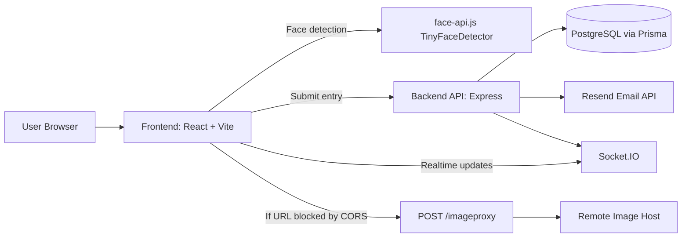

# Face Detector using API

Face Detector is a full-stack app with authentication, rankings, leaderboard, and browser-based face detection.

Detection now runs in the frontend using `face-api.js` (`TinyFaceDetector`), so you do not need third-party inference API tokens for normal face detection.

## Tech Stack

### Frontend

- React 19 + Vite 7
- Zustand (state management)
- Tailwind CSS 4
- face-api.js (client-side face detection)
- Socket.IO client (realtime leaderboard updates)

### Backend

- Node.js + Express 5
- Prisma ORM + PostgreSQL
- Argon2 password hashing
- Resend (password reset email)
- Socket.IO (realtime events)

### Deployment

- Vercel (separate projects for frontend and backend)

## System Design

### High-level architecture

1. Frontend collects image URL or uploaded image.
2. Frontend runs face detection in-browser with `face-api.js`.
3. If the image URL is blocked by CORS, frontend requests backend proxy (`POST /imageproxy`) to fetch and return a data URL.
4. On successful detection, frontend updates user entry count via backend (`POST /image`).
5. Backend persists user data in PostgreSQL through Prisma and emits realtime updates via Socket.IO.

### Architecture diagram



### Why this design

- No inference API tokens required for detection.
- Lower detection latency for many users because inference is local to browser.
- Backend remains responsible for auth, ranking, and secure workflows (password reset/email).

### Data model (Prisma)

- `users` (profile, email, entries, joined date)
- `login` (credential hash per user)
- `password_reset_tokens` (hashed token, expiry, used flag)

See `backend/prisma/schema.prisma` for exact schema.

## Project Structure

```text
backend/
 app.js               Express app and route wiring
 server.js            Local server + Socket.IO
 routes/              API endpoints
 prisma/              Schema, migrations, seed

frontend/
 src/app/services/faceDetection.js   face-api detection pipeline
 src/app/store/useAppStore.js        UI/app state orchestration
 public/models/                      face-api model files
```

## API Summary

- `GET /health` health check
- `POST /signin` sign in
- `POST /register` register account
- `GET /profile/:id` user profile
- `POST /image` increment user image-entry count
- `POST /imageurl` backward-compatible legacy endpoint
- `POST /imageproxy` fetch image safely for CORS-restricted URLs
- `GET /rank/:id` get user rank
- `GET /rank/leaderboard?limit=10` top users
- `POST /password/forgot` request password reset
- `POST /password/reset` reset password

## Environment Variables

### Backend (`backend/.env`)

- `DATABASE_URL` (required)
- `FRONTEND_URL` (required; supports comma-separated origins)
- `PORT` (optional, default `3000`)
- `RESEND_API_KEY` (required for password reset email)
- `RESEND_FROM_EMAIL` (required for password reset email)

### Frontend (`frontend/.env`)

- `VITE_BACKEND_URL` (optional; default `http://localhost:3000`)
- `VITE_WS_URL` (optional; default `VITE_BACKEND_URL`)
- `VITE_FACE_API_MODEL_URL` (optional; default `/models`)
- `VITE_ENABLE_REALTIME` (optional; set `false` to disable realtime)

## face-api Model Files

Place these files in `frontend/public/models`:

- `tiny_face_detector_model-weights_manifest.json`
- `tiny_face_detector_model-shard1`

These are required for local model loading. The app also includes CDN fallback model URLs, but shipping local files is recommended for reliability.

## Quick Start (Local)

### 1) Clone and install

```bash
git clone <your-repo-url>
cd Face-Detector-using-API

cd backend
npm install

cd ../frontend
npm install
```

### 2) Configure environment files

Create `backend/.env` and `frontend/.env` with the variables above.

### 3) Prepare database

From `backend`:

```bash
npx prisma migrate deploy
npm run prisma:seed
```

### 4) Run backend and frontend

Terminal 1:

```bash
cd backend
npm start
```

Terminal 2:

```bash
cd frontend
npm run dev
```

Open the frontend URL shown by Vite (usually `http://localhost:5173`).

## How To Use (Simple Guide)

1. Register a new account or sign in.
2. Paste an image URL or upload an image file.
3. Wait for auto-detection to run.
4. If faces are found, boxes are drawn and your entries count increases.
5. Open leaderboard/rank view to see your position.
6. If image URL detection fails due to CORS, try another URL or upload the image directly.

## Deployment (Vercel)

Deploy as two Vercel projects from the same repository.

### Backend project

- Root directory: `backend`
- Framework preset: `Other`
- Set backend environment variables

### Frontend project

- Root directory: `frontend`
- Framework preset: `Vite`
- Set frontend environment variables

After backend deployment, run:

```bash
cd backend
npx prisma migrate deploy
npm run prisma:seed
```

## Notes

- `frontend/vercel.json` handles SPA fallback.
- `backend/vercel.json` and `backend/api/index.js` handle serverless routing.
- Backend image proxy rejects localhost targets and limits image size to 8 MB.
